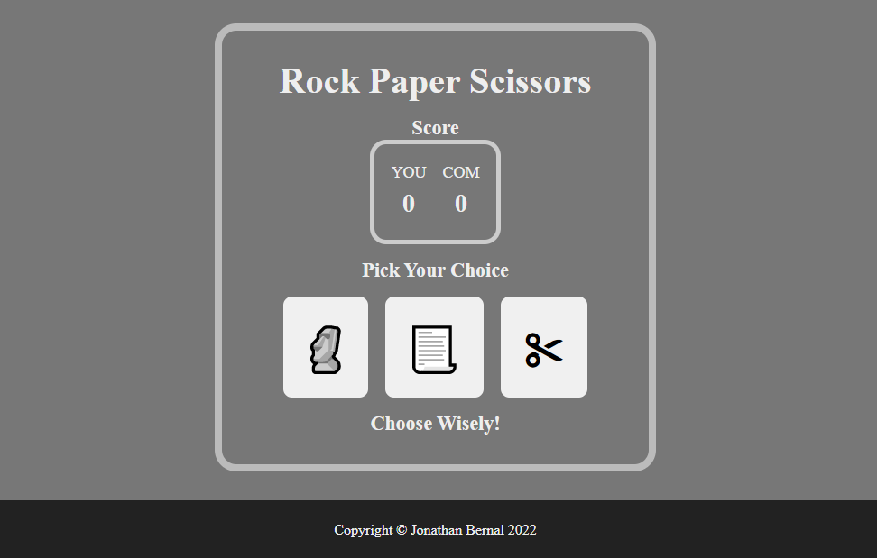

# 
Rock Paper Scissors

A website where you can play Rock Paper Scissors against the computer.

# Purpose
The purpose of this project was to make a game using HTML5, CSS, and JS only. No 3rd party libraries were used.

I also wanted to test some concepts I had learned recently, namely DOM manipulation and incorporating audio elements on a website. This took some thinking and quite some work. I am hoping that in the future, I can revamp the UI and add more animations to it to make the game more visually rewarding.

# How to Run
1. Open the file directory in your IDE of choice.
2. Open index.html on your Web browser.
3. Alternatively, if you're running the Live Server extension on VSCode, just press `Alt + L O`. This will open up the game on a localhost.

* You can also [view the live version](https://jonathanbernal.github.io/rock-paper-scissors/) from your Web browser.

# Credits
Scissors sound effect from <a href="https://pixabay.com/sound-effects/?utm_source=link-attribution&amp;utm_medium=referral&amp;utm_campaign=music&amp;utm_content=43842">Pixabay</a>

Rock sound Effect from <a href="https://pixabay.com/sound-effects/?utm_source=link-attribution&amp;utm_medium=referral&amp;utm_campaign=music&amp;utm_content=6409">Pixabay</a>

Paper sound effect from <a href="https://pixabay.com/?utm_source=link-attribution&amp;utm_medium=referral&amp;utm_campaign=music&amp;utm_content=5933">Pixabay</a>

Trumpet sound effect from <a href="https://pixabay.com/sound-effects/?utm_source=link-attribution&amp;utm_medium=referral&amp;utm_campaign=music&amp;utm_content=6185">Pixabay</a>

You lose sound effect from <a href="https://pixabay.com/sound-effects/?utm_source=link-attribution&amp;utm_medium=referral&amp;utm_campaign=music&amp;utm_content=88884">Pixabay</a>

Select sound Effect by <a href="https://pixabay.com/users/u_2fbuaev0zn-30247713/?utm_source=link-attribution&amp;utm_medium=referral&amp;utm_campaign=music&amp;utm_content=121244">u_2fbuaev0zn</a> from <a href="https://pixabay.com/sound-effects//?utm_source=link-attribution&amp;utm_medium=referral&amp;utm_campaign=music&amp;utm_content=121244">Pixabay</a>